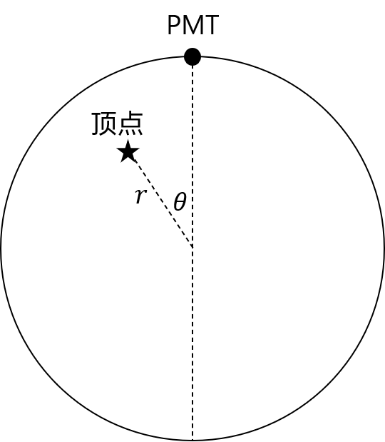

# probe 函数介绍

理解 probe 函数的含义对该比赛极为重要, 阅读此文档, 能够帮你在宣讲会的基础上更好地理解 probe 函数.

## JUNO 探测器中发生的物理过程

### JUNO 探测器

在 JUNO 探测器中, 最里面是一个装满了液体闪烁体 (液闪, liquid scintillator, LS) 的大球, **液闪球的半径为 $17.7 \,\text{m}$**, 粒子在其中会发光.

外面是一层水球包裹, 水球外面有 17612 个光电倍增管 (Photomultiplier, PMT), 这些 PMT 到球心的距离均为 $19.5 \,\text{m}$ , 其可以看作半径为 $50.8 \,\text{cm}$ 的球体, 且只有朝向探测器中心的那半个球面可以接收光. (这段信息在比赛中并不重要, 除非你要考虑使用物理建模分析的方法.)

在几何文件 `geo.h5` 的 `Geometry` 这个 dataset 中, 给出了所有 PMT 的编号与位置信息: 编号为 `ChannelID` , 从 `0` 开始; 由于所有 PMT 位于一个球面上, 所以对于位置信息只给出球坐标下的 `theta`, `phi` , 注意单位为**角度**.

### 顶点

液闪是一种特殊的有机物, 在(正或负)电子的激发下会发生能级跃迁, 各向同性地发出光子, 被 PMT 探测到, 这些发光的点被称作**顶点**. 顶点的坐标数据对应于训练集中 `ParticleTruth` 这个 dataset 的 `x`, `y`, `z` ; 而测试集中两个 dataset 的 `r`, `theta` , 则是[顶点相对于 PMT 的半径归一化球坐标](#probe-函数变量的含义---顶点相对于-pmt-的半径归一化球坐标).

通常来说，$\text{MeV}$ 量级的电子可以近似看作一个顶点, 它会迅速在某个位置耗尽所有动能并发出光子, 这是一个非齐次泊松过程, 该过程的典型的时间尺度大概为 $10 \,\text{ns}$ , 其对应训练集中 `PETruth` 这个 dataset 的 `LightTime` ; 对于相同能量量级的正电子, 其会先和电子一样消耗能量并发出光子, 然后再发生正负电子湮灭, 产生两个方向相反的、能量为 $511 \,\text{keV}$ 的 $\gamma$ 光子, 由于 $\gamma$ 光子能量较高, 其可能与许多电子发生康普顿散射, 又可以看作一群顶点.

对于中微子的探测, 其发生的典型反应为[反 $\beta$ 衰变](https://en.wikipedia.org/wiki/Inverse_beta_decay):
$$
\widetilde{\nu}_e + p \to e^+ +n
$$
所以, 可以近似的认为中微子发生反应的位置, 亦即正电子产生的位置, 即为**顶点**.

顶点的动能不会完全转化为发光光子的总能量（也称为可见能量）, 这两个能量分别对应于训练集中 `ParticleTruth` 这个 dataset 的 `Ek` 和 `Evis` , 前者会略大于后者 (你可以在本次比赛中不考虑这两个能量).

### PE

顶点发出的光子会在液闪中运动, 到达液闪与水的界面时, 由于液闪的折射率(可取为 $1.48$ )大于水的折射率(可取为 $1.33$ ), 可能会发生折射或(全)反射; 如果折射进入水中, 则其有可能会运动到水与 PMT (表面为玻璃)的界面, 可能会发生折射与反射; 如果进入 PMT , 则会产生光电子(photoelectron, PE), 这就是一个**PE**.

当然, 在该比赛中, 你可以无需在意上述复杂的光学过程, 而是把重点放在理解**顶点**与**PE**的关系上: 一个顶点会产生许多闪烁光子, 被 PMT 探测到的光子会转化为光电子 PE . 从顶点产生到闪烁光子被探测到的时间 (这包括发射光子的时间与光子运动的时间) 对应于训练集中 `PETruth` 这个 dataset 的 `PETime` , 以及测试集中 `Concat` 这个 dataset 的 `t` ; 在训练集 `PETruth` 这个 dataset 中, 还包含有闪烁光子命中的 PMT 编号 `ChannelID` , 可以与几何文件中的 `ChannelID` 相对应, 还有闪烁光子所来源的顶点编号 `EventID` , 从 `0` 开始, 可以与训练集 `ParticleTruth` 这个 dataset 中的 `EventID` 相对应.

## probe 函数的含义

### probe 函数变量的含义 - 顶点相对于 PMT 的半径归一化球坐标

probe 函数 $R(r, \theta, t)$ 或 $\lambda(r, \theta)$ 中的空间坐标 $(r, \theta)$ 是顶点相对于 PMT 的半径归一化球坐标.

其中的"半径归一化"不难理解, 就是把液闪球的半径视为 $1$ , 这样 $r$ 就被限制在了 $0 \sim 1$ 之间, 便于分析, 测试集中的 `r` 便是如此.

而"相对坐标"要这样理解: 我们在分析时, 把 1 个顶点相对于 17612 个 PMT 的响应, 转化为了 17612 个顶点相对于 1 个 PMT 的响应. 先考虑 1 个顶点对 1 个 PMT 的响应, 我们要以球心为旋转点旋转坐标系, 把 PMT 旋转到最上方的位置, 即球坐标 $r = 1, \theta = 0$ 的位置(或者说直角坐标 $(0, 0, 1)$ ), 顶点的坐标也会跟着旋转, 而对于不同的 PMT , 最终顶点被旋转到的位置是不同的, 这样就把 1 个顶点相对于 17612 个 PMT 的响应转化为了 17612 个顶点相对于 1 个位于最上方的 PMT 的响应, 同时也把一个三维的问题转化为了一个对称的二维问题.

就变量值而言, $r \in [0, 1]$ 为顶点距离球心的位置, $\theta \in [0, \pi]$ 为顶点与 PMT 相对球心的夹角, 如图所示.

### probe 函数值的含义

不含时的 probe 函数 $\lambda(r, \theta)$ 的值, 即为在相对位置 $(r, \theta)$ 的一个顶点, 被最上方的 PMT 探测到的光子数的期望. (根据前面对物理过程的介绍, 其实你可以发现这个函数的值还依赖于顶点的动能, 因为其与顶点放出的光子总数是呈正相关的, 但我们的数据集中顶点的动能是全同的, 所以在该比赛中你无需考虑.)

含时的 probe 函数 $R(r, \theta, t)$ , 即为在相对位置 $(r, \theta)$ 的一个顶点, 在其产生后的时刻 $t$ , 单位时间内被最上方的 PMT 探测到的光子数的期望.

不难发现，含时与不含时的 probe 函数满足:
$$
\lambda(r, \theta) = \int_{0}^{+\infty} R(r, \theta, t) \mathrm{d}t
$$
再具体实现中, 积分上限通常被取为一个较大的时间, 如 $T = 1000 \,\text{ns}$ .

不含时的 probe 函数可以被绘制为一个圆盘图像, 如下图所示:

## probe 函数的构造方法

[示例代码](https://ghgit.thudep.com/committee/Ghost-Hunter-JUNO-probe-2025)提供了一种直方图构造方法.

另外可以参考[续本达老师团队所积累的研究文档](../pdf/probe.pdf)。
